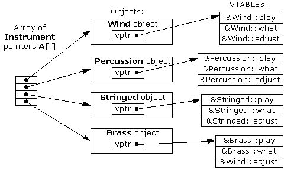
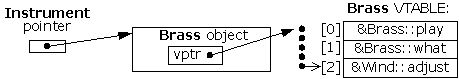
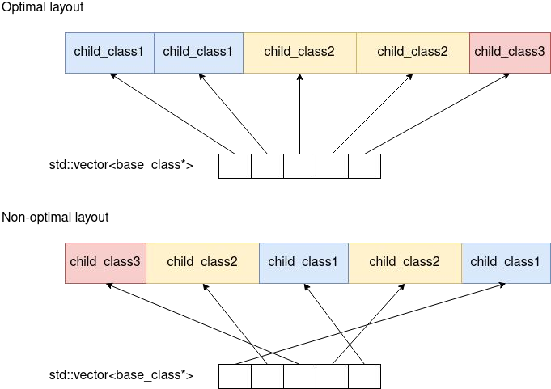

> This article is a dive into how virtual functions work in C++ behind the scenes.
> It explains some caveats we should have in mind when deciding whether to use it.

## Nature of Virtual Function
Due to the nature of virtual functions, there are some drawbacks compares to non-virtual functions.
- Virtual function's address is not known at compile time
- The program needs to look up the virtual function’s address at runtime (no optimization can be done)
- Virtual function’s address lookup is done through virtual table pointer
- How virtual function works behind the scenes:

_vtables_

_vptr_

## Analysis

Experiment:
- Vector of 20 million objects of the same
  - | virtual function call | non-virtual function call
     --- | --- | ---
     short and fast function | 153 (ms) | 126 (ms)
     Long and slow function | 32.090 (ms) | 31.848 (ms)
- Vector of pointers
  - Needs to be accessed through a pointer or a reference
  {: w="200"}
  - Accessing objects on the heap can be very slow
    - The reason are data cache misses
    - If objects are neighbours in memory, we can expect performance improvements
    - If objects are not neighbours in memory, we can expect slowdowns
    - If the neighbouring pointers do not point to neighbouring elements on the heap, we can expect data cache misses
  - There is no guarantee that the neighbouring pointers will point to neighbouring objects in memory
    - As the programme becomes bigger and more complex, less chances that it gets neighbouring objects in memory
  - Vector of objects is much better for its performance compared to vector of pointers
    - Vector of objects does not suffer from data cache misses

## Conclusion

- Memory layout is very important to programme performance
- Slow down is not necessarily relate to virtual function
  - The slow down is related to memory layout
  - However, the main reason we use vector of pointers is to achieve polymorphism
- Alternatives to vector of pointers
  - std::variant with std::visitor
  - Use polymorphic_vector
  - Use per type vector (e.g. boost::base_collection)

## Tips

Reason to use virtual functions:
- Virtual functions ensure that the correct function is called for an object, regardless of the type of reference (or pointer) used for the function call.
- They are mainly used to achieve `Runtime polymorphism`.
- The resolving of a function call is done at runtime.

Others:
- Virtual functions cannot be static.
- A virtual function can be a friend function of another class.
- Virtual functions should be accessed using a pointer or reference of base class type to achieve runtime polymorphism.
- The prototype of virtual functions should be the same in the base as well as the derived class.
- They are always defined in the base class and overridden in a derived class. It is not mandatory for the derived class to override (or re-define the virtual function), in that case, the base class version of the function is used.
- A class may have a virtual destructor but it cannot have a virtual constructor.

## References

Most of the article is based on Ivica Bogosavljevic talks along with some other resources.
- https://github.com/CppCon/CppCon2022/blob/main/Presentations/CppCon-The-Hidden-Performance-Price-of-Virtual-Functions.pdf
- https://www.geeksforgeeks.org/virtual-function-cpp
- https://www.geeksforgeeks.org/virtual-destructor
- https://www.geeksforgeeks.org/cpp-polymorphism
