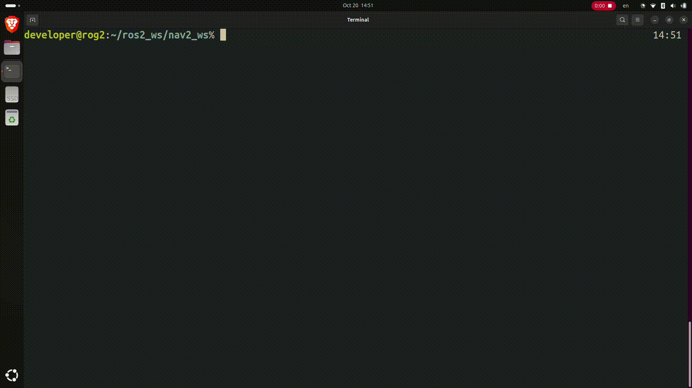

> The journey of writing a quick cd tool for ros2 packages.



If you use ROS (Robot Operating System) long enough,
you would know the command line tool `roscd`.
And once you start using ROS2, I am sure you would notice that the 
equivalent command is not available.


There are multiple reasons why there is not a `ros2cd` tool.
One of the reasons, is that ROS2 no longer have the concept of devel space for 
a workspace, hence, after the installation of the packages, we have no
correlation of the source space anymore. Therefore, the only possible location
to switch to would be the install space which is not what we developers wants.


If you dig deeper, you would find the `colcon_cd` tool. Unfortunately, this tool
is written by [someone](https://answers.ros.org/question/277801/ros2-roscd-feature/)
how has never used `roscd`. So to close this bridge,
let's dive into a simple solution for `ros2cd`, it is by no means perfect, but
hopefully a starting point where others could built on top and be helpful to
those who are used to `roscd` coming from ROS1.

## Thought Process

At the moment, tab completion feature is not available, it is only
a simple script to quickly bring the user to their developing packages.
I am also utilizing the `fzf` tool to allow the user to fuzzy search through
the available packages with `zsh`. Of course, bash users can use it without
any issue.

1. Obtain the path to the packages from the environment variables
1. Loop through the paths and save it to `trimmed_workspaces` variable 
   if it contains the `install` keyword
1. To ensure that the path is a ROS2 package, we will filter the obtained
   paths by checking whether package.xml file exist
1. Prompt users to choose with `fzf` to fuzzy search through the available
   packages
1. Lastly, jump to the selected directory

## Try Out!

The tool is currently on [GitHub](https://github.com/BruceChanJianLe/ros2cd),
please feel free to try it out! Suggestions and pull request are welcome!

```bash
curl -s https://raw.githubusercontent.com/BruceChanJianLe/ros2cd/refs/heads/master/install.sh | bash
```

## Future Work

One thing that could actually be worked on is to cache the results of the local
packages, instead of looking it up every single invoke of `ros2cd`.
Latency can be observed with large workspaces that has a lot of packages.


Surely, tab completion could also be something nice. Well below are some
references that I found useful for readings about zsh tab completion:

- https://mrigank11.github.io/2018/03/zsh-auto-completion/
- https://caelis.medium.com/create-basic-zsh-command-with-auto-completion-cc069f971ba8
- https://github.com/zsh-users/zsh-completions/blob/master/zsh-completions-howto.org
