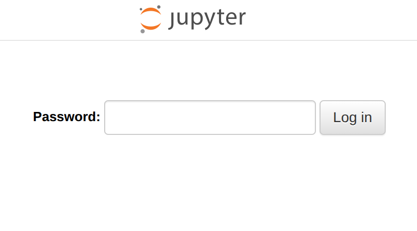

> This is another one for all you data scientists and ai lovers out there!
> Imagine!
> You have a wonderful GPU desktop and you have a long battery live laptop.
> Let's put it together and utilize the power of the desktop remotely!


Yes, not only you can do that, but also in a secure way!
We will fisrt go through how to setup jupyterlab fisrt and then tailscale
which is a curcial module that enables use to use this over network safely!

## Installation

If you already have JupyterLab installed, feel free to skip this section.
Otherwise, I recommend using Nix to install micromamba, and then using
micromamba to install JupyterLab.  

However, starting from **Ubuntu 22.04**, micromamba can no longer be installed
directly from nix-env due to gcc version. To work around this, we’ll use
a Nix flake to install it instead.

### 1. Install Nix

You can install Nix easily using my [ansible playbook](https://github.com/brucechanjianle/ansible).  

```bash
# Installing nix
ansible-pull -U https://github.com/brucechanjianle/ansible --ask-become-pass --tags nix
```

### 2. Install micromamba with Nix Flake

Next, let’s install micromamba using a flake-based project:  

```bash
git clone https://github.com/BruceChanJianLe/micromamba.git
cd micromamba
nix develop -c $SHELL
which micromamba
# This is important!!! An example output would be the below:
# /nix/store/qgmx5z2bd6i3q0vpz4qgipajf5wdwnf8-micromamba-1.5.8/bin/micromamba
```

### 3. Install JupyterLab

```bash
/nix/store/qgmx5z2bd6i3q0vpz4qgipajf5wdwnf8-micromamba-1.5.8/bin/micromamba create -n jupyterlab jupyterlab -c conda-forge
```

## Setup Jupyterlab As Service

This setup is similar to my previous post on [automagically start jupyterlab](https://brucechanjianle.github.io/posts/cs-automagically-start-jupyterlab/).
If you’re already familiar with systemd user services, feel free to skip ahead.

### 1. Create Service Directory

User-level services live under your home directory and start when you log in
(instead of at system boot). Let’s create the directory:  

```bash
mkdir ~/.config/systemd/user/ -p
```

### 2. Add the Service File

Create a new service file for JupyterLab:  

```bash
# You can use nano if vim is not something you are familiar with :)
vim ~/.config/systemd/user/jupyter_notebook.service 
```

Paste the following content, updating the micromamba path where necessary:  
```bash
[Unit]
Description=Jupyter Lab Server
After=network.target

[Service]
ExecStart=/nix/store/qgmx5z2bd6i3q0vpz4qgipajf5wdwnf8-micromamba-1.5.8/bin/micromamba run -n jupyterlab jupyter lab --port 7777 --no-browser
WorkingDirectory=%h
# Restart=on-failure
Environment=RORT=7777
StandardOutput=journal
StandardError=journal

[Install]
WantedBy=default.target
```

This runs JupyterLab from your home directory on port 7777. You can change the
working directory or port if needed, for example, 8888 is the default for
manual launches.

## Enable HTTPS and Remote Access

By default, JupyterLab only accepts local connections. Let’s fix that securely.  

### 1. Generate a Configuration File

```bash
/nix/store/qgmx5z2bd6i3q0vpz4qgipajf5wdwnf8-micromamba-1.5.8/bin/micromamba run -n jupyterlab jupyter lab --generate-config
```

Then open the generated configuration file:  

```bash
# You may use nano if you're not familiar with vim :D
vi $HOME/.jupyter/jupyter_lab_config.py
```

Enable remote access:  

```python
c.ServerApp.allow_remote_access = True
```

### 2. Generate SSL Certificates

Let’s create a self-signed certificate (valid for 10 years):  

```bash
openssl req -x509 -nodes -days 3650 -newkey rsa:2048 -keyout jupyterlab.key -out jupyterlab.pem
```

Then update the configuration file with your certificate paths:

```python
c.ServerApp.certfile = '/path/to/jupyterlab.pem'
c.ServerApp.keyfile = '/path/to/jupyterlab.key'
```

Finally, set a fixed base URL (important for reverse proxying):  

```bash
c.ServerApp.base_url = 'jupyter'
```

## Setting Up Tailscale

Now comes the fun part, securing and exposing JupyterLab through Tailscale,
so you can access it from anywhere on your tailnet.

### 1. Install Tailscale

Sign up at [tailscale.com](https://tailscale.com) and install the client:  

```bash
curl -fsSL https://tailscale.com/install.sh | sh
```

Then authenticate your machine:  

```bash
sudo tailscale up
# This will allow user to use tailscale without sudo
sudo tailscale set --operator=$USER
```

### 2. Test the Setup

You can now serve your local JupyterLab securely over your tailnet:  

```bash
tailscale serve --https=7777 --set-path /jupyter https+insecure://localhost:7777/jupyter
```

This will print something like:  

```bash
# Available within your tailnet:
# 
# https://dev.coat-grey.ts.net:7777/jupyter
# |-- proxy https+insecure://localhost:7777/jupyter
# 
# Press Ctrl+C to exit.
```

Here, `https+insecure` is used because we’re serving a self-signed HTTPS
certificate. Now we should be able to access it jupyterlab through
`https://dev.coat-grey.ts.net:7777/jupyter`.  

Alternatively, we can always run this command with --bg for it to run in the
background, but I personally feel like using a linux service to handle this is
more deterministic.  

Great! So now, let us add another linux service to ensure we have jupyterlab
always accessible when it turns on.  

### 3. Automating Tailscale Service

You can stop the previous command now, because instead of running the above
command manually, let’s automate it with another user-level service.

```bash
# As always can you nano if you want :)))
vim ~/.config/systemd/user/tailscale_jupyter_notebook.service 
```

Paste the following:  

```bash
[Unit]
Description=Tailscale for Jupyter Lab
After=network.target tailscaled.service jupyter_notebook.service
Requires=jupyter_notebook.service

[Service]
ExecStart=/usr/bin/tailscale serve --https=7777 --set-path /jupyter https+insecure://localhost:7777/jupyter

[Install]
WantedBy=default.target
```

## Enabling the Services

Now that we are done defining both the services, we can finally activate them!  

Reload and enable both services:  

```bash
systemctl --user daemon-reload
systemctl --user enable jupyter_notebook.service
systemctl --user enable tailscale_jupyter_notebook.service
```

Start them for the first time:  

```bash
systemctl --user start jupyter_notebook.service
systemctl --user start tailscale_jupyter_notebook.service
```

Well, you will only need to do this once, since it has been enabled to 
start this service after reboot.

## Jupyterlab Password Protection

Well, if you're sharing the desktop among your friends or colleague, perhaps
you want one more layer of protection.  

Generate a hashed password:  

```bash
/nix/store/qgmx5z2bd6i3q0vpz4qgipajf5wdwnf8-micromamba-1.5.8/bin/micromamba run -n jupyterlab jupyter lab password
```

This writes a hash to `$HOME/.jupyter/jupyter_server_config.json`,
for example:  

```json
{
  "IdentityProvider": {
    "hashed_password": "argon2:$argon2id$v=19$m=10240,t=10,p=8$Tfwj5iovyI97/2Tl3GIPAQ$hPfLb+WN6614k2NpRC2HoFYQ8dxp6kXSxdnQzORrsEs"
  }
}
```

Copy the hashed password and update your `$HOME/.jupyter/jupyter_lab_config.json`.  
```python
c.ServerApp.password = 'argon2:$argon2id$v=19$m=10240,t=10,p=8$Tfwj5iovyI97/2Tl3GIPAQ$hPfLb+WN6614k2NpRC2HoFYQ8dxp6kXSxdnQzORrsEs'
```

Restart JupyterLab:  

```bash
systemctl --user restart jupyter_notebook.service
```

You should see the following prompt when you enter jupyterlab! But once you
have key in you do not need to re-authenticate yourself, unless, you come in
from a new browser.  



## Well Done

To validate whether the service has been run succesfully, you can run:  

```bash
systemctl --user status jupyter_notebook.service
systemctl --user status tailscale_jupyter_notebook.service
```

If both show as active (running) then congratulations!  

Well, give yourself a hand! You've made it so far, hopefully this is as helpful
to you as it was for me. And with this you now have a secure, remote-access
JupyterLab instance running on your powerful desktop, accessible from anywhere
in the globe through Tailscale.  

Until next time, keep learning and keep building!  
