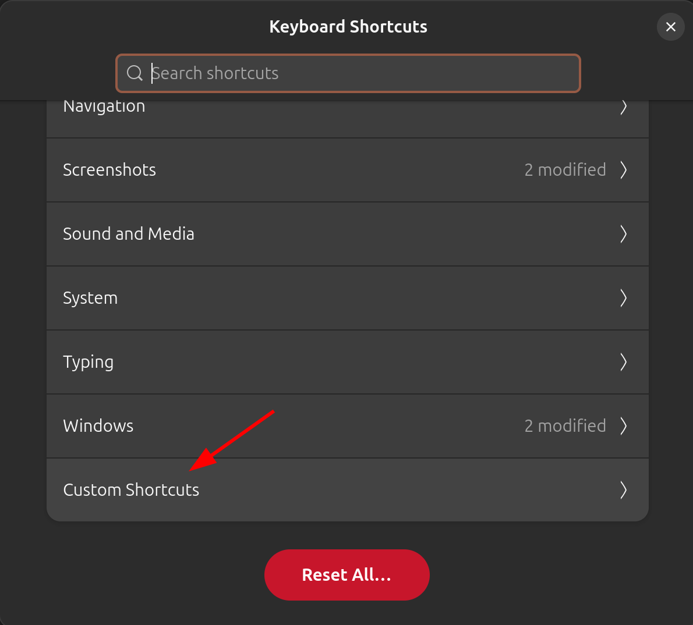
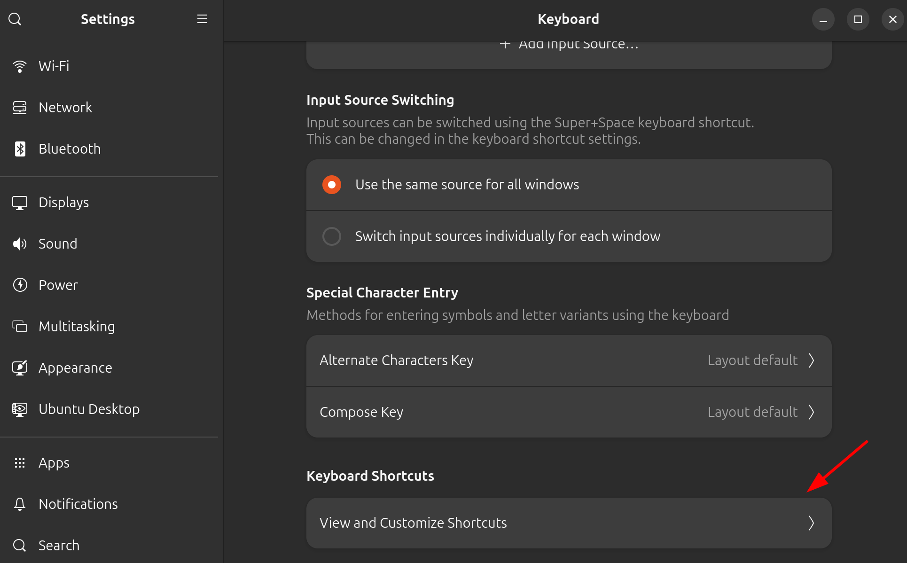
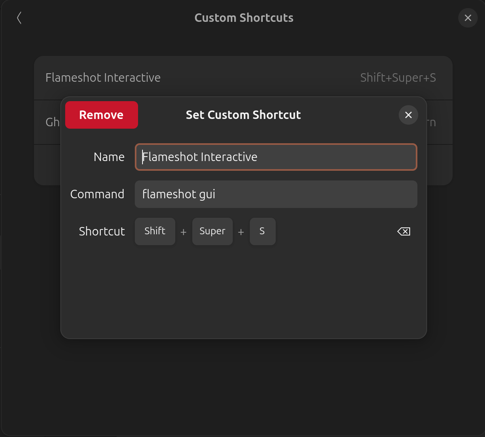

> If you take screenshots often, whether for bug reports, documentation, tutorials,
> or quick sharing - Flameshot is one of those tools that quietly becomes indispensable
> once you start using it.

Flameshot is a free, open-source screenshot utility best known in the Linux community,
but also available on Windows and macOS. At its core, it does one thing extremely well:
it lets you capture screenshots quickly, then edit and annotate them instantly, without
jumping between multiple apps.

There are plenty of videos out there explaining the benefits of Flameshot, so
I’ll simply leave a link here for you to check out: [intro](https://youtu.be/zavmtaqMY_A?t=228).
The goal of this article is to help you get Flameshot up and running on your
Ubuntu machine, specifically Ubuntu 24.04, which is the latest version at the
time of writing.

## Installation

First off, I wouldn’t recommend installing Flameshot via `apt`, `snap` or even
`nix`. Screenshot tools require certain permissions, and in my experience, I
was only able to get everything working reliably using `Flatpak`. So that’s
what we’ll use here.  

`Flatpak` is a universal Linux packaging system that lets applications run the same way across
different distributions by bundling their dependencies instead of relying on system libraries.
It also uses sandboxing to improve security and reliability while making apps easier to install
and update.  

Let's install it:  

```bash
sudo apt install flatpak
```

Next, download the latest `flameshot` release from the official GitHub releases
page: https://github.com/flameshot-org/flameshot/releases

Download the version that matches your system, then run the following commands.
Make sure to replace the version number with the one you downloaded:

```bash
cd ~/Downloads
flatpak install org.flameshot.Flameshot-13.3.0.x86_64.flatpak
```

If this is your first time using `flatpak`, it may take a while to download the
required runtime dependencies before `flameshot` can be installed. Just be
patient.  

## Post Installation

Once `flameshot` is installed, you’ll need to grant it permission to take screenshots:

```bash
flatpak permission-set screenshot screenshot org.flameshot.Flameshot yes
```

To start `flameshot`, run:  

```bash
flatpak run org.flameshot.Flameshot
```

To immediately take a screenshot:  

```bash
flatpak run org.flameshot.Flameshot gui
```

## Shortcuts

If you prefer a shorter, more familiar command, you can create a symbolic link:  

```bash
ln --symbolic /var/lib/flatpak/exports/bin/org.flameshot.Flameshot ~/.local/bin/flameshot
```

This allows you to use `flameshot` like a regular command-line tool:  

```bash
# start flameshot
flameshot

# take a screenshot
flameshot gui
```

You can also set up a GNOME keyboard shortcut to quickly trigger `flameshot`.  

First, open the keyboard shortcut settings:  

  

Scroll all the way down and select Custom Shortcuts:  

  

Configure your `flameshot` shortcut like this. Keep in mind that doing so will
disable the original screenshot shortcut:  

  

## Summary

Well, `flameshot` is a fast, lightweight, and highly practical screenshot tool
that fits naturally into a Linux workflow. Hopefully, this article helps you
avoid some of the pitfalls I encountered while getting flameshot up and running.
With that, you’ve just leveled up your daily screenshot workflow, until next
time, keep learning and growing!  
